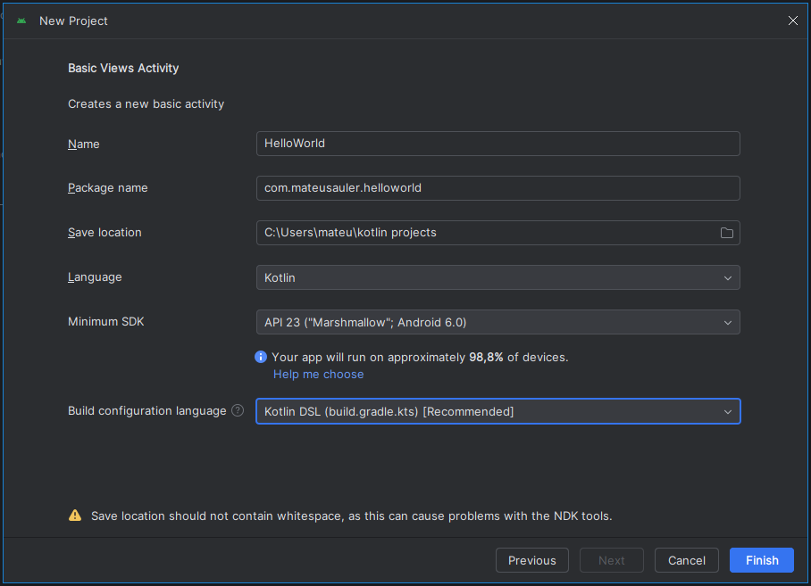

# Primeiros Passos

#### [Slack geral](https://app.slack.com/client/T06D2A72TPY/C06MM9EFLM7)
#### [Slack programação](https://app.slack.com/client/T06310CGG9K)

## Configurando Android Studio

### Android Studio
    - Principal ferramenta de desenvolvimento
    - Guia de instalação:
#### [developer.android.com](https://developer.android.com/studio/install)
#### [Android Studio](https://developer.android.com/studio?hl=pt&gclid=Cj0KCQjwkIGKBhCxARIsAINMioLJTmJGGvZ7xrTvNY8MSFfEXn-y_d6blP0FSgPcCd3BZ5W7PdYKea4aArOIEALw_wcB&gclsrc=aw.ds)

### Configurar “SDK Manager”
    SDK Platforms
        - pelo menos as 2 versões mais recentes do sistema
        
    SDK Tools
        - "Android Emulator Hypervisor"
        - "Intel x86"
        - "Google Play services"
        - "Google USB Driver"

### Emulador
    - Testar aplicação simulando diversas condições
    - Testar diferentes versões do Android
        - incluindo as versões beta
    - Simular o comportamento de um telefone específico
        - por exemplo:
            - da marca x
            - da marca y  

### Configurar “AVD Manager”
    - Android Virtual Device

## Projeto Hello World
    - "New Project"
    - "Phone and Tables"
    - "Basic Activity"
    - name
        - HelloWorld
    - packageName
        - com.mateusauler.helloworld

## Conceitos importantes

    Build
        - pega o programa e constrói ele
        - baixar todas as dependências
        - compilar
        - gerar código executável

    Cache
        - espaço que armazena dependências e bibliotecas
        - com o tempo fica mais rápido para as próximas vezes

    "package name"
        - identificador do nosso programa
        - único

    /res (pasta)
        - pasta resource
        - arquivos adicionais
        - conteúdo estático
        - arquivos que não são de código
            - string
            - imagens

## Estrutura do app

    app > java >
        - /com.mateusauler.helloworld
                - armazenado nossos códigos fontes
        - /com.mateusauler.helloworld (androidTest)
                - pasta para teste funcional
                - testar pasta toda
        - /com.mateusauler.helloworld (test)
                - pasta para teste unitário
                - testar parte do código

    app > manifests > 
        - AndroidManifest.xml
                - informações essenciais
                - permissões
                - componentes do app

    app > res >
        - /drawable
                - ícone do aplicativo
        - /layout
                - todas as telas da aplicação
        - /menu
                - itens do menu
        - /mipmap
                - ícones
        - /navigation
                - navegação
        - /values 
                - strings.xml
                - colors.xml

## Exercício

    Criar seu próprio App
        - criar novo projeto
        - alterar o código para mostrar "Eu amo programar"
        - rode o projeto em um emulador ou o próprio celular

