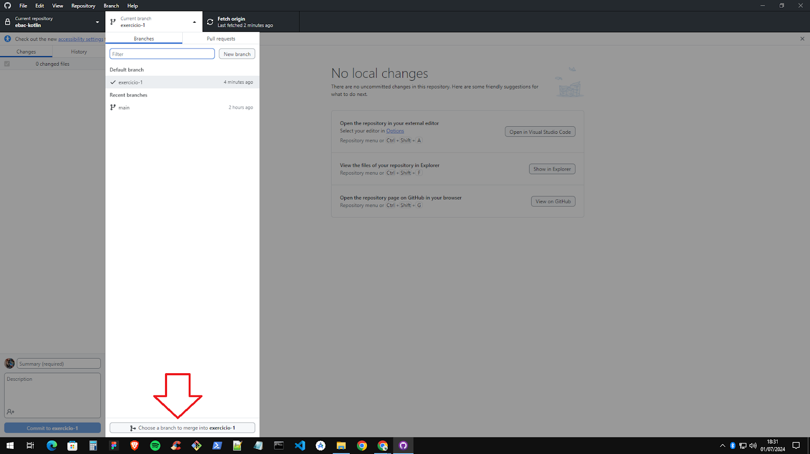

# Versionamento de código

- "Qual a última versão do código que eu fiz?"
- Desenvolvimento **incremental**
- Ferramenta de versionamento de código

#### 2 tipos:

### Centralizado
    - mais antigo
    - todo o código fica em um único servidor central
    - commit direto no servidor
    - histórico no servidor
    - no nosso computador está apenas uma cópia daqueles arquivos que estamos trabalhando no momento

    Exemplos:
    - CVS
    - SVN
    - TFVC

### Distribuído
    - mais usado
    - cada desenvolvedor tem uma cópia inteira do repositório na sua máquina
    - commits locais
    - histórico locais
    - offline
    - atualização mais rápida
    - enviar para o servidor nossa cópia do repositório

    Exemplos:
    - Mercurial
    - Git

## Git
    - comunidade grande
        - 88,4% dos desenvolvedores
    - suporte multiplataforma
    - simples
    - muita documentação
    - padrão do mercado
    - usa o conceito de árvore

### Branches
    - "galho da árvore"
    - ramificação
    - tronco principal
        - main
    - primeira coisa é criar um branch local para trabalhar em cima dele
    - no final envia o código novo para o branch principal

### Commit
    - salvar arquivos
    - salvar só na máquina local
    - pronto para ser salvo
    - mantém um histórico do que se está fazendo

### GitHub
    - Git
        - tecnologia responsável pelo versionamento de código
        - base do versionamento
    - GitHub
        - versionamento com redes sociais
        - repositório online de projetos
            - públicos ou privados
        - compartilhar código com a comunidade
        - comunidade open source
        - automações no nosso projeto
        - mais profissional

### Configuração do git

#### [Git - Downloading Package](https://git-scm.com/download/win)

#### [GitHub Desktop](https://github.com/apps/desktop)


## Comandos básicos

Site de pesquisa, referência e exemplos de comandos.

#### [GitCheatSheet.org](https://gitcheatsheet.org/)
#### [Search | Git Cheat Sheet](https://gitcheatsheet.org/search)


### clone
    - cópia local do repositório
    - cópia de tudo que está no servidor naquele momento
    - cópia histórico, commits e branches
    - precisa da URL do repositório

### pull
    - atualiza o "clone"
    - pega a versão mais recente do servidor remoto
    - atualiza a cópia local do branch atual

> "Tudo corresponde/depende do branch que se está no momento."

### checkout
    - seleciona branch que vamos usar
    - troca de branch/prints
    - jeito prático de criar novo branch (na linha de comando)

> Caso faça alterações sem dar um commit no final e dar o checkout, as alterações te seguem ao outro branch.

### branch
    - listar todos os branches
    - dar nomes relevantes
    - criar e deletar branches
    - "new branch"
    - primeira coisa a fazer ao criar nova funcionalidade

### add
    - adicionar à lista de coisas a serem salvas
    - adiciona uma modificação para a lista de coisas que vamos fazer commit

> O maior erro no começo é fazer um commit sem adicionar os arquivos.

### commit
    - salva as alterações da lista de modificações feitas pelo comando "add"
    - salvar lista de modificações que a gente fez
    - adicionar um comentário ao commit
        - comentário que faz sentido
        - descrever o que as alterações estão fazendo
    - melhor ter commits pequenos
        - com bastante contexto do que foi feito
    - salva o commit na minha máquina
    - salva o histórico

### push
    - envia ao servidor remoto todas as alterações do commit
    - pega os commits e salva no servidor
    - usar uma vez ao dia mais ou menos
        - final do dia

### merge
    - adiciona as alterações feitas em outro branch ao branch atual
    - integrar as coisas
    - voltar ao branch principal
    - normalmente precisa resolver conflitos
    - trazer informações de outro branch



### pull request
    - pedido para alterar o código "main"
    - não é permitido fazer um "push" diretamente para o "main"
    - para incluir código na "main"
        - precisamos abrir um "pull request"
    - código fica disponível para colegas revisarem
    - pelo menos 1 colega precisa revisar e aceitar as modificações

### conflitos
- Quando mais de uma pessoas está trabalhando no mesmo código é comum acontecerem conflitos
- 2 alterações no mesmo trecho do código
- git não sabe qual das duas usar

## Exemplos de uso dos comandos


```sh
git checkout main 
# trocar de branch
```

```sh
git clone https://github.com/mateusheberle/ebac-kotlin.git
```

```sh
git branch 
# listar todos os branches
```

```sh
git checkout -b linha-de-comando 
# criar e entrar no novo branch "linha-de-comando"
```

```sh
git checkout linha-de-comando 
# entrar no branch "linha-de-comando"
```

```sh
git status 
# mostrar modificações
```

```sh
git commit -m"Teste"
```

```sh
git add README.md
```

```sh
git push --set-upstream origin linha-de-comando
# precisa avisar para qual branch
# deseja fazer o commit, nesse caso "linha-de-comando"
```

```sh
git merge origin main
```

### GitHub

    - git ignore
        - não subir arquivos que só servem para uso local

    - "Fetch origin"
        - verifica no servidor remoto se tem modificação

    - git add
        - apenas marcar o checkbox ou desmarcar

    - excluir pasta no GitHub
```sh
git rm -r --cached nome_da_pasta
```
### Passo-a-passo
1. novo repositório
2. novo branch
3. adicionar mudanças
4. fazer commit
5. push


### Git Bash
- terminal do git
- [Acessar o Git Bash com token](https://github.com/settings/tokens?type=beta)

### Revisão de código

> "O melhor jeito de saber a qualidade do seu código é o nível de
vergonha que você tem em mostrá-lo para outro programador."

    - momento de outras pessoas olharem e revisarem o seu código
        - com sugestões
    - momento de aprender e ensinar
        - compartilhar conhecimento
    - revisar boas práticas
    - revisar regras de negócio
    - explicar o que está fazendo
    - conta com a experiência dos colegas
    - refletir com os feedbacks
        - não é pessoal
    - manter a mente aberta
        - existem diferentes formas de fazer algo